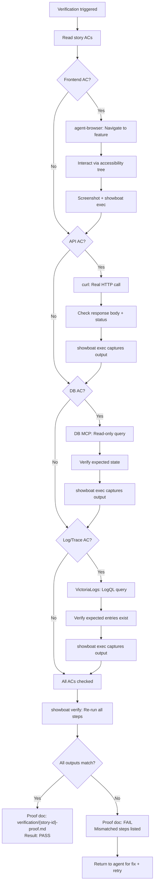
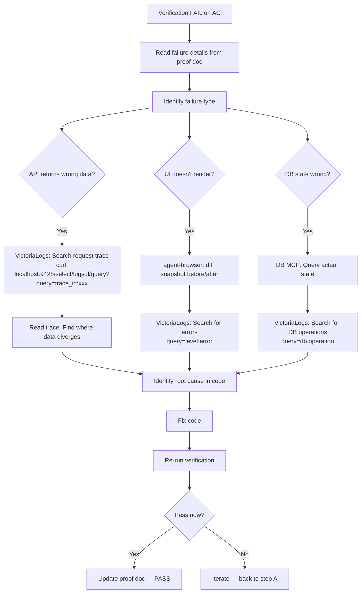

# UX Design Specification codeharness

**Author:** Ivintik
**Date:** 2026-03-14

---

<!-- UX design content will be appended sequentially through collaborative workflow steps -->

## Executive Summary

### Project Vision

codeharness is a CLI-only Claude Code plugin with no graphical interface. The UX is the developer experience: command output, hook feedback, error messages, status reporting, and proof document structure. Every interaction happens in the terminal or through markdown documents (Showboat proof, status reports).

The core UX principle: **trust through proof**. The user should be able to read a Showboat proof document and trust the feature works — without opening a browser or running manual checks.

### Target Users

Senior developers and technical leads comfortable with CLI tools, Docker, and autonomous agent workflows. They are power users who value density and clarity over polish. They've been burned by false "done" signals from autonomous agents and want reproducible evidence, not status badges.

Key user characteristics:
- CLI-native — prefers terminal over GUI
- Experienced with Docker, CI/CD, agent workflows
- Values actionable output over verbose explanations
- Reads proof documents, not dashboards
- Trust must be earned through real evidence

### Key Design Challenges

1. **Init output management** — `/harness-init` performs 6+ operations (stack detection, Docker start, OTLP install, BMAD setup, hook installation, MCP config). Output must be structured as progressive disclosure: summary line per operation, expandable details only on failure.

2. **Hook message quality** — Hook blocks are the primary enforcement UX. Every block message must be immediately actionable: state what's missing, name the command to fix it, reference the specific story/task. No generic "verification required" messages.

3. **Dual audience output** — Agent-consumed output (hook prompts, verification results) and human-consumed output (`/harness-status`, Showboat proof docs) have different needs. Agent output: structured, parseable, dense. Human output: scannable, hierarchical, with clear status indicators.

4. **Failure recovery UX** — When external dependencies fail (Docker down, agent-browser unavailable, VictoriaMetrics crashed), error output must diagnose and prescribe — not just report.

### Design Opportunities

1. **Showboat proof documents as UX artifacts** — The proof doc is the primary deliverable users interact with. Well-structured proof docs (clear AC headers, evidence blocks, summary with pass/fail counts) create the trust the product promises.

2. **`/harness-status` as single-glance health view** — Modeled on `git status`: dense, scannable, actionable. Shows harness health, verification state per story, pending items, and next action.

3. **Error messages as guides** — Every error includes: what failed, why it matters, and the exact command to fix it. No "check the docs" — the error IS the doc.

## Core User Experience

### Defining Experience

The core experience is the **autonomous verification loop**: the user starts work (`/harness-run` or `/harness-verify`), the agent builds and verifies autonomously, and the user reviews Showboat proof documents that contain real evidence — screenshots, API responses, DB state, log queries. The defining moment is reading the proof doc and trusting it without manual re-checking.

The secondary experience is **init**: answering 3-4 questions and having a complete harness (observability stack, instrumentation, hooks, MCP) configured automatically. First-time setup should feel like magic, not configuration.

### Platform Strategy

- **Platform:** Terminal-only (CLI). No GUI, no web interface, no dashboard.
- **OS:** macOS and Linux (bash-compatible hooks)
- **Input:** Keyboard. Slash commands, yes/no prompts during init.
- **Output:** Terminal text (command output, hook messages), markdown documents (Showboat proof, status reports)
- **Dependencies:** Docker (required), Claude Code plugin system
- **No offline mode** — requires Docker for VictoriaMetrics, network for OTLP

### Effortless Interactions

1. **Init configuration** — 3-4 yes/no questions → complete harness. No manual file editing, no Docker Compose authoring, no OTLP configuration. Auto-detect stack, auto-install dependencies, auto-configure everything.

2. **Hook enforcement** — Invisible when things are correct. The user never thinks about hooks until one blocks an action — and when it does, the message is immediately actionable.

3. **Status checking** — `/harness-status` is a single command that shows everything: harness health, verification state, pending items. Modeled on `git status` — dense, scannable, no scrolling.

4. **Teardown** — `/harness-teardown` removes everything the harness added. No manual cleanup. Non-destructive to project source code.

### Critical Success Moments

1. **First init completes** — User answers questions, sees checkmarks, harness is running. Under 2 minutes from install to operational. Reaction: "That was surprisingly easy."

2. **First proof doc review** — After autonomous work, user reads structured evidence: real screenshots, actual API responses, confirmed DB state, passing `showboat verify`. Reaction: "I don't need to check this myself."

3. **First hook catch** — Agent blocked from committing without proof. Agent self-corrects, finds a real bug during verification. Reaction: "It caught something tests missed."

4. **First observability-assisted debug** — Agent queries VictoriaLogs, traces the issue, fixes root cause in one iteration instead of shotgun debugging. Reaction: "This is why the stack exists."

### Experience Principles

1. **Proof over promise** — Never claim "it works." Provide reproducible evidence (Showboat docs) that anyone can independently re-verify. Trust is earned through proof, not assertions.

2. **Actionable over informative** — Every output tells the user (or agent) what to DO next. Hook blocks name the missing step and the command to fix it. Errors prescribe the resolution. No "something went wrong" without "here's how to fix it."

3. **Progressive disclosure** — Summary first, details on demand. Init shows 6 status lines, not 200 lines of Docker output. `/harness-status` shows health at a glance, with drill-down available. Proof docs show pass/fail summary before individual AC evidence.

4. **Self-correcting by design** — The harness guides the agent to fix problems without human intervention. Hook messages are prompts that teach the agent what to do. The autonomous loop should self-correct for known failure patterns — the user intervenes only for novel problems.

## Desired Emotional Response

### Primary Emotional Goals

**Confidence** is the primary emotional outcome. The user must feel genuinely confident that autonomously-produced software works — because they have reproducible proof, not because the system told them so. This is the emotional core of codeharness: transforming skepticism into trust through evidence.

**Control** is the secondary emotional goal. Even during autonomous execution, the user should feel they can check status, understand what happened, and intervene if needed. The harness is powerful but never opaque.

### Emotional Journey Mapping

| Stage | Without Harness | With Harness | Design Driver |
|-------|----------------|--------------|---------------|
| **Setup** | Tedious configuration | Effortless auto-setup | Auto-detection, 3-4 yes/no questions |
| **Starting work** | Anxiety about quality | Calm confidence | SessionStart hook confirms harness health |
| **During execution** | Blind, no visibility | Informed, in control | `/harness-status`, VictoriaLogs queries visible |
| **Reviewing results** | Skepticism, manual re-checking | Trust via proof | Showboat docs with real screenshots, API responses, DB state |
| **Something fails** | Frustration, shotgun debugging | Empowered, directed | VictoriaLogs traces to root cause, actionable error messages |
| **Returning** | Dread, what broke? | Continuity | Persistent state file, harness picks up where it left off |

### Micro-Emotions

**Confidence over skepticism** — The defining emotional shift. Proof docs must be convincing enough that the user stops manually re-checking. If the user still feels compelled to open the browser after reading the proof doc, the UX has failed.

**Control over helplessness** — The user is never locked out of understanding what the harness did. Status is always available. Hook decisions are always explained. Verification results are always readable.

**Efficiency over tedium** — Every interaction respects the user's time. Init is fast. Status is dense. Teardown is clean. No configuration marathons, no scrolling through logs to find the one line that matters.

**Calm over anxiety** — The harness works silently when things are correct. Hooks are invisible until needed. The observability stack runs in the background. The user's attention is only demanded when something requires it.

### Design Implications

- **Confidence** → Showboat proof docs structured with clear AC-by-AC evidence, pass/fail counts, `showboat verify` re-run capability. Evidence is real (screenshots, curl output, DB queries), not synthetic.
- **Control** → `/harness-status` provides single-glance health. Hook block messages always include: what's blocked, why, and the exact command to resolve. No black boxes.
- **Efficiency** → Progressive disclosure everywhere. Init shows checkmarks per step, not Docker pull logs. Status shows summary, not raw state file YAML. Proof docs show summary before detail.
- **Calm** → SessionStart hook silently confirms harness health — no output unless something's wrong. Hooks allow silently when verification state is good. Quiet when correct, loud when wrong.

### Emotional Design Principles

1. **Silence means success** — When the harness is working correctly, it's invisible. Output only appears when attention is needed. No "everything is fine" confirmations cluttering the terminal.

2. **Evidence creates trust** — Never ask the user to take the system's word for it. Always provide verifiable evidence. The Showboat proof doc is the trust artifact.

3. **Frustration is a design bug** — If the user feels frustrated by the harness (too many blocks, unclear messages, slow operations), that's a UX defect to fix, not a user problem.

4. **Respect attention** — The user's attention is the scarcest resource. Only demand it when genuinely needed. Make every output scannable. Make every message actionable.

## UX Pattern Analysis & Inspiration

### Inspiring Products Analysis

**1. `git` — Status as UX**
`git status` is the gold standard for CLI status reporting: dense, color-coded, scannable, actionable. Shows staged/unstaged/untracked in clear sections with hints about what to do next. Template for `/harness-status`.

**2. `cargo` (Rust) — Error Messages as Documentation**
Best-in-class error output. Every error includes: what went wrong, where it happened, why, and how to fix it. Often includes code snippets and suggestions. Template for hook block messages and harness error output.

**3. `gh` (GitHub CLI) — Interactive Prompts + Structured Output**
Combines interactive prompts (during `gh pr create`) with structured non-interactive output (`gh pr status`). Model for `/harness-init` interactive setup and `/harness-status` reporting.

**4. `docker compose` — Progressive Service Status**
During `up`, shows per-service status lines that update in place. Failures show the specific service and its error. Model for VictoriaMetrics stack startup output during `/harness-init`.

**5. NanoClaw — Agent-as-Interface**
Radical approach: no installation wizard, no dashboard, no debugging tools. Claude Code IS the interface — `/setup` skill handles everything, status is asked not displayed, problems are described not debugged. The codebase is deliberately small enough that the agent can understand all of it. Key insight: minimize dedicated tooling, let the agent handle complexity. Skills transform the codebase instead of configuration flags.

### Transferable UX Patterns

**Output Patterns:**
- `git status` model → `/harness-status`: sections for harness health, verification state, pending items, suggested next action
- `cargo` error model → Hook block messages: what's blocked, why, how to fix, exact command to run
- `docker compose up` model → Init output: per-component status line, update in place, expand on failure only

**Interaction Patterns:**
- `gh` interactive prompts → `/harness-init` questions: clear defaults, minimal questions, progressive disclosure of advanced options
- NanoClaw skills-as-features → Skills teach the agent verification patterns rather than hardcoded configuration paths
- NanoClaw agent-as-interface → The agent handles complexity; artifacts (proof docs, status) are the human interface

**Information Architecture:**
- Summary → Detail (progressive disclosure from `git status`)
- Section-based grouping (from `git status` staged/unstaged/untracked model)
- Color as meaning, not decoration (from `cargo`: red = error, yellow = warning, green = success)

### Anti-Patterns to Avoid

1. **Wall-of-text output** — Docker build logs, npm install verbose output. Never dump raw logs. Always summarize with drill-down.
2. **Generic error messages** — "Something went wrong. Check the logs." Every error must be specific and prescriptive.
3. **Configuration sprawl** — Dozens of flags and options. NanoClaw's lesson: keep the surface small, let the agent handle complexity.
4. **Silent failures** — Tools that fail and return 0. Every failure must be loud, specific, and actionable.
5. **Dashboard dependency** — Requiring the user to open a separate tool (Grafana, web UI) to understand what happened. Everything must be accessible from the terminal or markdown docs.

### Design Inspiration Strategy

**Adopt:**
- `git status` section-based, scannable output format for `/harness-status`
- `cargo`-style prescriptive error messages for all hook blocks and errors
- NanoClaw's "small enough to understand" — keep the plugin codebase auditable

**Adapt:**
- `gh` interactive prompts for `/harness-init` — but fewer questions than `gh pr create` (3-4 max, with smart defaults from stack detection)
- NanoClaw's agent-as-interface — adopt the spirit (minimize tooling, agent handles complexity) but keep async artifacts (proof docs, status) because the user isn't watching during autonomous execution
- `docker compose` progressive output — adapt for all multi-step operations (init, verify, teardown)

**Avoid:**
- npm-style verbose install output
- Configuration file editing as primary UX
- Separate dashboard or web UI dependency
- "Check the docs" error messages

## Design System Foundation

### Design System Choice

**N/A — CLI Plugin (No Visual UI)**

codeharness has no graphical interface. No web frontend, no desktop UI, no mobile app. Traditional design systems (Material Design, Tailwind, etc.) do not apply.

The equivalent for a CLI plugin is an **Output Format System** — consistent patterns for how all terminal output and markdown documents are structured across the entire plugin.

### Rationale for Selection

- **Platform:** Terminal-only. All output is plain text (terminal) or markdown (proof docs, status reports).
- **Team:** Solo developer. No design team. No visual design needed.
- **Brand:** None. Developer tool. Clarity and density over visual identity.
- **Constraints:** Claude Code plugin system. Output is text rendered in the user's terminal with their font/color preferences.

### Implementation Approach

**Terminal Output System:**

All command and hook output follows consistent patterns:

1. **Status lines:** `[OK] Component name — detail` / `[FAIL] Component name — what went wrong`
2. **Section headers:** Bold text (markdown-style) separating logical groups
3. **Actionable hints:** Indented lines starting with `→` showing what to do next
4. **Error format:** What failed → Why it matters → How to fix it (exact command)

**Example — `/harness-init` output:**
```
Harness Init — codeharness v0.1.0

[OK] Stack detected: Node.js (package.json)
[OK] Docker: running
[OK] VictoriaMetrics stack: started (logs:9428, metrics:8428, traces:14268)
[OK] OTLP instrumentation: installed (@opentelemetry/auto-instrumentations-node)
[OK] BMAD: installed (v6.1.0), harness patches applied
[OK] Hooks: 4 registered (session-start, pre-commit, post-write, post-test)
[OK] MCP: agent-browser + postgres configured

Harness ready. Run /harness-run to start autonomous execution.
```

**Example — Hook block message:**
```
[BLOCKED] Commit blocked — story US-003 has no verification proof.

→ Run /harness-verify to verify US-003 acceptance criteria
→ Or run /harness-status to see all pending verifications
```

**Markdown Document System:**

All generated markdown documents (Showboat proofs, status reports) follow:

1. **Frontmatter:** YAML with structured metadata (story ID, timestamp, pass/fail counts)
2. **Summary section:** First section is always a pass/fail summary — scannable without reading the full doc
3. **AC sections:** One `### AC` section per acceptance criterion with evidence blocks
4. **Evidence blocks:** Labeled with type (screenshot, curl output, DB query, log query)

### Customization Strategy

No visual customization needed. The output format system is internal — consistent patterns enforced across all commands, hooks, and generated documents. Customization is limited to:

- **Enforcement level** — configured in `.claude/codeharness.local.md` (which components are active)
- **Proof document template** — `templates/showboat-template.md` defines the structure
- **Hook message templates** — embedded in hook scripts, follow canonical format from architecture doc

## Defining Core Experience

### Defining Experience

**"Read the proof. Trust the result."**

The defining experience is the moment the user reviews a Showboat proof document after autonomous execution. The proof doc contains real screenshots, actual API responses, confirmed database state, and log query results — all re-verifiable via `showboat verify`. If this document convinces the user the feature works without manual checking, codeharness has delivered.

How users describe it to colleagues: "I kick off a sprint, come back, and there's a proof document for every story with real screenshots, real API responses, and database state. I run `showboat verify` and everything re-checks. I don't open the browser."

### User Mental Model

**Current mental model (without codeharness):**
"Autonomous agents produce code that passes tests. I have to manually verify everything actually works. Tests passing means nothing — I've been burned too many times."

**Target mental model (with codeharness):**
"The harness verifies by actually using what the agent built. The proof doc shows real evidence. If `showboat verify` passes, it works. I verify by reading, not by clicking."

**Mental model shift required:**
- From "tests = verification" → "real-world interaction = verification"
- From "trust the agent's self-report" → "trust reproducible evidence"
- From "I need to check everything" → "the proof doc checked it for me"

**Where users might get confused:**
- First time seeing a proof doc — what am I looking at? (Summary section addresses this)
- "Is this evidence real or synthetic?" (Showboat's `verify` command re-runs everything)
- "What if the proof doc misses something?" (AC-driven verification ensures coverage)

### Success Criteria

The core experience succeeds when:

1. **User reads proof doc without opening browser** — The proof doc is sufficient. If the user still opens the browser to check, the proof doc failed.
2. **`showboat verify` passes on re-run** — Evidence is reproducible, not stale.
3. **Each AC has corresponding evidence** — No acceptance criterion is claimed without proof.
4. **Evidence types match the claim** — UI claims have screenshots. API claims have curl output. DB claims have query results. Log claims have LogQL output.
5. **Summary is scannable in <10 seconds** — Pass/fail per AC, total counts, one-glance assessment.

### Novel UX Patterns

**Novel: Verification-as-proof (not verification-as-testing)**

This is genuinely new. No existing tool produces reproducible proof documents with real evidence that anyone can re-verify. The pattern combines:
- Showboat's exec→verify cycle (proven tool, novel application)
- agent-browser's accessibility-tree interaction + screenshot capture
- Structured evidence blocks mapped to acceptance criteria

**Established: CLI command patterns**

All commands (`/harness-init`, `/harness-verify`, `/harness-status`, `/harness-teardown`) use standard CLI patterns. No new interaction paradigm to learn. Users who know `git`, `docker`, `gh` will feel at home.

**Established: Hook enforcement**

Claude Code hooks are a known pattern. PreToolUse blocks, PostToolUse prompts. Users familiar with git hooks or CI gates understand immediately.

**Teaching the novel pattern:**
- First proof doc includes a "How to read this" header (only on first generation, not subsequent)
- `showboat verify` output explains what it's doing: "Re-running step 3 of 12... output matches original"
- Knowledge files teach the agent how to generate clear, well-structured proof docs

### Experience Mechanics

**1. Initiation:**
- User runs `/harness-run` (autonomous) or `/harness-verify` (manual)
- Or: Ralph loop triggers verification automatically after story implementation
- No user action needed during autonomous execution — verification is part of the loop

**2. Interaction (agent-side):**
- Agent implements story → quality gates (tests, lint, typecheck)
- Agent opens agent-browser, navigates to feature, interacts via accessibility tree
- Agent makes real API calls, checks response bodies AND side effects
- Agent queries DB via MCP, confirms state changes
- Agent queries VictoriaLogs for expected log entries and traces
- Each step wrapped in `showboat exec` to capture evidence

**3. Feedback:**
- Per-AC evidence blocks in proof doc: `[PASS]` or `[FAIL]` with evidence
- `showboat verify` re-runs all steps, reports match/mismatch
- Hook allows commit only after verification passes
- `/harness-status` shows verification state across all stories

**4. Completion:**
- Proof doc generated at `verification/{story-id}-proof.md`
- Summary section: X/Y ACs passed, total verification steps, `showboat verify` result
- Story marked verified in state file
- Agent commits (hook allows) and moves to next story
- User reviews proof doc asynchronously — the artifact IS the completion signal

## Visual Design Foundation

### Color System

**N/A — Terminal output uses semantic markers, not colors.**

codeharness does not control terminal colors. Output is plain text rendered by the user's terminal with their theme. Instead of colors, the plugin uses **text-based semantic markers**:

| Marker | Meaning | Example |
|--------|---------|---------|
| `[OK]` | Success/healthy | `[OK] Docker: running` |
| `[FAIL]` | Failure/error | `[FAIL] VictoriaMetrics: not responding` |
| `[BLOCKED]` | Action prevented by hook | `[BLOCKED] Commit blocked — no proof` |
| `[WARN]` | Warning, non-blocking | `[WARN] agent-browser unavailable, UI verification skipped` |
| `[PASS]` | Verification AC passed | `[PASS] AC1: User can register` |
| `[INFO]` | Informational | `[INFO] Stack detected: Node.js` |
| `→` | Actionable hint | `→ Run /harness-verify` |

These markers work in any terminal, any theme, any font. No ANSI color codes in plugin output.

### Typography System

**N/A — Terminal monospace font, user-controlled.**

All output is monospace text in the user's terminal. Markdown documents use standard markdown heading hierarchy:

- `#` — Document title (proof doc title, status report title)
- `##` — Major sections (Verification Summary, per-Epic sections)
- `###` — Sub-sections (per-AC evidence, per-story status)
- `**bold**` — Emphasis within prose (key values, status markers)
- `` `code` `` — Commands, file paths, tool names

No custom fonts, no type scale, no line-height specifications.

### Spacing & Layout Foundation

**Markdown document layout conventions:**

1. **Proof documents:** Summary at top → per-AC sections → footer with metadata
2. **Status output:** One section per category (harness health, verification state, pending items), blank line between sections
3. **Hook messages:** Status line → blank line → actionable hints (indented with `→`)
4. **Init output:** One line per component, no blank lines between status lines, blank line before final summary

**Information density:** Dense. No decorative whitespace. Every line carries meaning. Modeled on `git status` — the user scans, not reads.

### Accessibility Considerations

- **No color-dependent information** — All semantic meaning conveyed via text markers (`[OK]`, `[FAIL]`, etc.), not color alone
- **Screen reader compatible** — Plain text output, no ANSI escape sequences, no cursor manipulation
- **Markdown documents** — Standard heading hierarchy for assistive technology navigation
- **No minimum font size concerns** — User controls their terminal font
- **High contrast by default** — Text markers are unambiguous regardless of terminal color scheme

## Design Direction Decision

### Design Directions Explored

Three output format directions were evaluated for codeharness's key artifacts (Showboat proof documents, `/harness-status` output, hook messages):

- **Direction A: Minimal** — Ultra-dense, one line per AC, no section headers. Inspired by NanoClaw's "less is more" philosophy. Risk: too terse for first-time users, evidence not inspectable.
- **Direction B: Structured** — Full sections per AC with labeled evidence blocks. Inspired by `git status` sections. Risk: verbose, requires scrolling for multi-AC stories.
- **Direction C: Hybrid** — Dense tabular summary at top, full evidence details below the fold. Inspired by `cargo` output (summary + details). Best of both: scannable AND inspectable.

### Chosen Direction

**Direction C: Hybrid** — Dense summary for scanning, full evidence for verification.

The proof doc has two reading modes:
1. **Scan mode** (5 seconds): Read the summary table — PASS/FAIL per AC, total count, `showboat verify` result
2. **Inspect mode** (on demand): Scroll to evidence details — curl output, screenshots, DB queries, log queries

Same pattern applied to `/harness-status`: health summary at top, per-story verification state in the middle, actionable next step at bottom.

### Design Rationale

- **Matches target user** — Senior devs scan first, drill down only when needed. Dense summary respects their time.
- **Supports dual audience** — Agent reads the full doc for context. Human reads the summary. Both get what they need.
- **Scales with story complexity** — Simple stories: summary is enough. Complex stories: evidence details are there when needed.
- **Aligns with experience principles** — Progressive disclosure (Principle 3), respect attention (Emotional Principle 4), proof over promise (Principle 1).

### Implementation Approach

- **Proof doc template** (`templates/showboat-template.md`): Summary table section + per-AC evidence sections. Agent fills both.
- **Status command** (`commands/harness-status.md`): Generates text output following the hybrid pattern — health line, enforcement line, sprint progress table, next action hint.
- **Hook messages**: Always follow the single-line-status + actionable-hint pattern. No evidence needed — hooks are about what to do, not what happened.

## User Journey Flows

### Journey 1: New Project Setup (Human)

**Entry:** User runs `claude plugin install codeharness` in a new or existing project.

```mermaid
flowchart TD
    A[claude plugin install codeharness] --> B[/harness-init]
    B --> C{BMAD detected?}
    C -->|No _bmad/| D[Install BMAD via npx bmad-method init]
    C -->|_bmad/ exists| E{bmalph detected?}
    E -->|Yes| F[Migration: preserve artifacts, apply patches]
    E -->|No| G[Apply harness patches to existing BMAD]
    D --> H[Stack Detection]
    F --> H
    G --> H
    H --> I{package.json?}
    I -->|Yes| J[Node.js stack — install OTLP auto-instrumentation]
    I -->|No| K{requirements.txt / pyproject.toml?}
    K -->|Yes| L[Python stack — install OTLP distro]
    K -->|No| M[Unknown stack — ask user]
    J --> N[Enforcement Config]
    L --> N
    M --> N
    N --> O["Frontend? (y/n)"]
    O --> P["Database? (y/n)"]
    P --> Q["APIs? (y/n)"]
    Q --> R[Generate docker-compose.harness.yml]
    R --> S[Start VictoriaMetrics stack]
    S --> T{Docker running?}
    T -->|No| U["[FAIL] Docker not running\n→ Install Docker and retry"]
    T -->|Yes| V[Configure .mcp.json]
    V --> W[Install hooks]
    W --> X[Write .claude/codeharness.local.md]
    X --> Y["[OK] Harness ready\n→ Run /harness-run to start"]
```

**Error recovery:** Every step checks prerequisites. Failures are immediate with prescriptive messages. `/harness-init` is idempotent — running twice is safe.

### Journey 2: Autonomous Sprint Execution (Human + Agent)

**Entry:** User runs `/harness-run` after successful init.

```mermaid
flowchart TD
    A[/harness-run] --> B[Read BMAD sprint plan]
    B --> C[bridge.sh: Convert stories to task list]
    C --> D[ralph.sh: Start external loop]
    D --> E[Spawn fresh Claude Code instance]
    E --> F[SessionStart hook: Verify harness healthy]
    F --> G{Harness healthy?}
    G -->|No| H["[FAIL] Harness not running\n→ Run /harness-init"]
    G -->|Yes| I[Agent reads story from task]
    I --> J[Agent implements story]
    J --> K[PostToolUse hooks fire on writes]
    K --> L[Agent runs quality gates: tests, lint, typecheck]
    L --> M{Gates pass?}
    M -->|No| N[Agent fixes issues, retry]
    N --> J
    M -->|Yes| O[/harness-verify triggers verifier subagent]
    O --> P[Subagent: Real-world verification]
    P --> Q{Verification pass?}
    Q -->|No| R[Agent reads failure details]
    R --> S[Agent queries VictoriaLogs for root cause]
    S --> J
    Q -->|Yes| T[Showboat proof doc generated]
    T --> V[Pre-commit hook: proof exists? allow commit]
    V --> W[Agent commits + marks story done]
    W --> X{More stories?}
    X -->|Yes| D
    X -->|No| Y[Mandatory retrospective]
    Y --> Z[Sprint complete — user reviews proof docs]
```

### Journey 3: Per-Story Verification (Agent)

**Entry:** Triggered by `/harness-verify` or automatically during Ralph loop.



### Journey 4: Debugging with Observability (Agent)

**Entry:** Verification fails — evidence doesn't match expectations.



### Journey 5: Brownfield Onboarding (Human + Agent)

**Entry:** User runs `/harness-onboard` after `/harness-init` on an existing project.

```mermaid
flowchart TD
    A[/harness-onboard] --> B[Spawn onboarder subagent]
    B --> C[Scan codebase structure]
    C --> D[Detect modules/subsystems]
    D --> E[Run coverage analysis]
    E --> F[Audit existing documentation]
    F --> G[Generate Analysis Report]
    G --> H[Generate root AGENTS.md from actual structure]
    H --> I[Generate draft ARCHITECTURE.md if missing]
    I --> J[Scaffold docs/ with index.md]
    J --> K[Generate Onboarding Epic]
    K --> L{Coverage gap stories — 1 per uncovered module}
    K --> M{Architecture doc story}
    K --> N{Per-module AGENTS.md story}
    K --> O{Doc freshness story}
    L --> P[Present Onboarding Plan to user]
    M --> P
    N --> P
    O --> P
    P --> Q{User approves?}
    Q -->|No| R[User edits plan]
    R --> P
    Q -->|Yes| S[Write onboarding epic to BMAD format]
    S --> T[/harness-run executes onboarding sprint]
    T --> U[Each story verified via normal pipeline]
    U --> V[/harness-status shows compliance %]
    V --> W{100% compliant?}
    W -->|No| X[Remaining stories in next iteration]
    W -->|Yes| Y["[OK] Project fully harnessed"]
```

**Output example — `/harness-onboard` analysis report:**
```
Harness Onboard — codeharness v0.1.0

Project: my-api (Node.js)
Modules: 5 detected (auth, routes, services, utils, db)

[INFO] Coverage: 40.2% (target: 100%)
  Uncovered:
    src/routes/admin.ts           0% (142 lines)
    src/services/notifications.ts 0% (89 lines)
    src/services/billing.ts       12% (201 lines)
    src/utils/validation.ts       0% (45 lines)
    src/db/migrations.ts          0% (67 lines)

[INFO] Documentation:
    README.md                     exists, stale (last updated 3 months ago)
    ARCHITECTURE.md               missing — will generate from code analysis
    Per-module AGENTS.md          0/5 modules have AGENTS.md
    Inline docs (JSDoc)           23% of exports documented

[INFO] Onboarding Epic: 8 stories generated
    Story 1: Write tests for auth module (estimated: 45 lines to cover)
    Story 2: Write tests for routes module (estimated: 142 lines)
    Story 3: Write tests for services/notifications (estimated: 89 lines)
    Story 4: Write tests for services/billing (estimated: 201 lines)
    Story 5: Write tests for utils + db (estimated: 112 lines)
    Story 6: Generate ARCHITECTURE.md from code analysis
    Story 7: Create per-module AGENTS.md (5 modules)
    Story 8: Update README + inline docs

→ Review the onboarding plan. Approve with /harness-run to start.
```

### Journey Patterns

**Common patterns across all journeys:**

1. **Check-then-act** — Every action checks prerequisites first. Init checks Docker. Hooks check state file. Verification checks harness health. Failures are immediate and prescriptive.

2. **Evidence-driven feedback** — No status without evidence. "PASS" always has proof. "FAIL" always has the specific failure. "BLOCKED" always has the missing requirement.

3. **Iterative convergence** — Implement → verify → fail → diagnose → fix → verify again. The loop converges because each iteration has more information (logs, traces, previous failure details).

4. **Graceful degradation path** — If agent-browser unavailable: skip UI verification with `[WARN]`. If VictoriaMetrics down: detect at SessionStart, block until fixed. No silent skips.

### Flow Optimization Principles

1. **Minimize human touchpoints** — The autonomous loop should run without human intervention. Human enters at init and exits at proof review. Everything between is agent-driven.

2. **Fail fast, fail loud** — Don't let failures accumulate. SessionStart hook catches harness problems before work begins. Pre-commit hook catches missing verification before code is committed.

3. **Preserve context across iterations** — When verification fails and the agent retries, the failure evidence (proof doc, VictoriaLogs queries) carries forward. The agent doesn't start from scratch.

4. **Single source of truth** — State file (`.claude/codeharness.local.md`) is the only place verification state lives. Hooks, commands, and skills all read from and write to the same file.

## Component Strategy

### Plugin Component Inventory

codeharness has no UI components. The "components" are the plugin artifacts defined by Claude Code's plugin system, plus the output templates the plugin generates.

**Plugin system components (from architecture):**

| Type | Count | Purpose |
|------|-------|---------|
| Commands | 5 | User-invoked slash commands |
| Skills | 4 | Auto-triggered agent knowledge |
| Hooks | 4 | Mechanical enforcement (bash scripts) |
| Agents | 2 | Subagents for isolated work |
| Knowledge files | 5 | Context loaded into agent memory |
| Templates | 8+ | Docker Compose, OTLP setup, Showboat proof, BMAD patches |

### Output Artifact Components

These are the "custom components" — reusable output structures that must be consistent across the plugin.

**1. Showboat Proof Document**

**Purpose:** Primary trust artifact. Reproducible evidence that a story's ACs are met.
**Structure:** Summary table → per-AC evidence sections → metadata footer
**States:** PASS (all ACs verified), FAIL (one+ AC failed), PARTIAL (verification incomplete)
**Generated by:** Verifier subagent during `/harness-verify`
**Consumed by:** Human (review), agent (re-verification), `showboat verify` (re-run)

**2. Status Report**

**Purpose:** Single-glance harness health and sprint progress.
**Structure:** Health line → enforcement config → sprint progress table → next action hint
**States:** Healthy (all systems up), Degraded (warnings), Broken (failures blocking work)
**Generated by:** `/harness-status` command
**Consumed by:** Human (status check), agent (SessionStart health check)

**3. Hook Message**

**Purpose:** Enforcement feedback — block or prompt the agent.
**Structure:** Status line (`[BLOCKED]`/`[WARN]`) → reason → actionable hint (`→`)
**Variants:**
- **Block message** (PreToolUse): Prevents action, prescribes fix
- **Prompt message** (PostToolUse): Suggests next step, doesn't block
- **Health check** (SessionStart): Verifies harness state, blocks if broken
**Generated by:** Hook bash scripts
**Consumed by:** Agent (action guidance), human (log review)

**4. Init Report**

**Purpose:** Summary of `/harness-init` results.
**Structure:** Per-component status line (`[OK]`/`[FAIL]`) → final summary → next action
**States:** Success (all components configured), Partial failure (some components failed), Total failure (critical dependency missing)
**Generated by:** `/harness-init` command
**Consumed by:** Human (setup confirmation)

**5. Retrospective Report**

**Purpose:** Sprint analysis with actionable follow-up.
**Structure:** Sprint summary → verification effectiveness → test analysis → doc health → common failure patterns → follow-up items
**Generated by:** Mandatory retro after sprint completion + doc-gardener subagent
**Consumed by:** Human (sprint review), BMAD (follow-up stories)

**6. Quality Score Report**

**Purpose:** Documentation health grades per area of the project.
**Structure:** Overall grade → per-area grades → stale doc list → freshness violations
**States:** Healthy (all docs fresh), Warning (some stale), Critical (widespread staleness)
**Generated by:** Doc-gardener subagent during retro
**Consumed by:** Human (doc health review), retro (follow-up items)

**7. Exec-Plan**

**Purpose:** Per-story context and progress tracking, adapted from BMAD story definitions.
**Structure:** Story summary → ACs → progress log → verification status → (on completion) proof link
**States:** Active (in `docs/exec-plans/active/`), Completed (moved to `completed/` with proof link)
**Generated by:** Sprint start (from BMAD stories), updated during implementation
**Consumed by:** Agent (story context), human (progress review)

**8. AGENTS.md**

**Purpose:** Progressive disclosure entry point for agents — map to project structure and BMAD artifacts.
**Structure:** Build & test commands → architecture overview → conventions → security → pointers to docs/
**Constraint:** Must not exceed 100 lines. Content beyond that goes in referenced docs.
**Generated by:** `/harness-init` (root), agent (per-subsystem, as modules created)
**Consumed by:** Agent (context on every session start)

### Component Implementation Strategy

All output artifacts follow the **Hybrid Direction C** pattern established in the Design Direction Decision:
- Dense summary at top for scanning
- Detailed content below for inspection
- Actionable hints for next steps

**Consistency rules:**
- All status markers use the same vocabulary: `[OK]`, `[FAIL]`, `[BLOCKED]`, `[WARN]`, `[PASS]`, `[INFO]`
- All actionable hints use `→` prefix
- All documents with structured data use YAML frontmatter
- All generated markdown follows the heading hierarchy from the Visual Design Foundation

**Template-driven generation:**
- Proof docs generated from `templates/showboat-template.md`
- Docker Compose from `templates/docker-compose/` fragments
- OTLP setup from `templates/otlp/` per-stack files
- BMAD patches from `templates/bmad-patches/`

### Implementation Roadmap

**Phase 1 — Core (MVP):**
- Hook message format (used by all 4 hooks — needed first)
- Init report format (used by `/harness-init` — first user interaction)
- Showboat proof template (core value proposition)
- Status report format (user's ongoing interaction)
- AGENTS.md template (generated during init)
- Exec-plan template (generated per story at sprint start)

**Phase 2 — Integration:**
- Retrospective report format (post-sprint, including doc health + test analysis sections)
- BMAD patch templates (story, dev workflow, code review, retro — with doc + test requirements)
- Docker Compose generation templates
- Quality score report format (doc-gardener output)
- Test coverage report format (per-sprint trends)

**Phase 3 — Refinement:**
- First-time proof doc "How to read this" header
- Sprint summary aggregation (across multiple proof docs)
- Verification analytics output (patterns across sprints)
- Per-subsystem AGENTS.md generation guidance (knowledge file)

## UX Consistency Patterns

### Command Output Pattern

**When to use:** Every slash command (`/harness-init`, `/harness-verify`, `/harness-status`, `/harness-teardown`, `/harness-run`)

**Structure:**
```
[Command Name] — codeharness v{version}

[Per-step status lines]

[Summary line]
→ [Next action hint]
```

**Rules:**
- First line: command name + version (context for logs)
- Status lines: one per logical operation, `[OK]`/`[FAIL]` prefix
- Summary: one sentence, what happened overall
- Next action: always end with what to do next (`→` prefix)
- No output on success for background operations (hooks)

### Error & Failure Pattern

**When to use:** Any operation that fails — hook blocks, init failures, verification failures, dependency missing.

**Structure:**
```
[FAIL] What failed — brief description

Why: One sentence explaining the impact
Fix: Exact command or action to resolve

→ Alternative action if applicable
```

**Rules:**
- Never just "Error" or "Failed" — always say WHAT failed
- Always include WHY it matters (not just the technical error)
- Always include HOW to fix it (exact command, not "check the docs")
- If multiple fixes exist, list them in order of likelihood

**Examples:**
```
[FAIL] VictoriaMetrics stack not responding — logs and traces unavailable

Why: Agent cannot query runtime behavior without the observability stack
Fix: docker compose -f docker-compose.harness.yml up -d

→ Run /harness-status to verify stack health after restart
```

```
[FAIL] Docker not installed — cannot start observability stack

Why: VictoriaMetrics requires Docker. This is a hard dependency.
Fix: Install Docker from https://docs.docker.com/get-docker/

→ After installing, run /harness-init again
```

```
[BLOCKED] Commit blocked — project-wide test coverage at 94.2% (required: 100%)

Uncovered files:
  src/routes/admin.ts        lines 42-58
  src/utils/validation.ts    lines 12-20

→ Write tests for uncovered code, then retry commit
```

```
[BLOCKED] Commit blocked — 3 tests failing

Failing tests:
  src/__tests__/auth.test.ts  ✗ should reject expired tokens
  src/__tests__/user.test.ts  ✗ should validate email format
  src/__tests__/user.test.ts  ✗ should hash password on save

→ Fix failing tests, then retry commit
```

```
[BLOCKED] Commit blocked — AGENTS.md stale for changed module

Stale docs:
  src/routes/AGENTS.md    last updated: 2026-03-10, code changed: 2026-03-14

→ Update src/routes/AGENTS.md to reflect current module structure
```

```
[WARN] New module created without AGENTS.md

Module: src/services/notifications/

→ Create src/services/notifications/AGENTS.md with module purpose, exports, and dependencies
```

### Verification Evidence Pattern

**When to use:** Every piece of evidence in a Showboat proof document.

**Structure:**
```
### [PASS/FAIL] AC{N}: {criterion description}

**Type:** {screenshot | curl | db-query | logql}
**Command:** {exact command that was run}
**Expected:** {what we expected to see}
**Actual:** {what we got}

{showboat exec block with real output}
```

**Rules:**
- Always state expected vs. actual (even on PASS — for auditability)
- Always include the exact command (reproducibility)
- Always label the evidence type
- Screenshots referenced by path: `verification/screenshots/{story-id}-{ac}.png`

### State Transition Pattern

**When to use:** Any operation that changes harness state (init, verify, teardown, loop iteration).

**Rules:**
- Read current state from `.claude/codeharness.local.md` before any action
- Write updated state after successful completion
- Never write partial state — operation succeeds fully or state unchanged
- Session flags (`logs_queried`, `verification_run`) reset on SessionStart

### Hook Enforcement Pattern

**When to use:** All hook scripts (PreToolUse, PostToolUse, SessionStart, Stop).

**Decision flow:**
1. Read state file — if missing, `allow` (harness not initialized)
2. Check relevant condition (e.g., proof exists for pre-commit)
3. If condition met: `{"decision": "allow"}` + `exit 0` (silent)
4. If condition not met: `{"decision": "block", "reason": "..."}` + `exit 2` (loud)
5. For PostToolUse prompts: `{"message": "..."}` + `exit 0` (suggestive, not blocking)

**Rules:**
- Silent on success (Emotional Principle: silence means success)
- Loud on failure (prescriptive message with fix command)
- Never `exit 1` (that's script error, not intentional block)
- Always check state file existence first (graceful when harness not init'd)

### Idempotency Pattern

**When to use:** `/harness-init`, `/harness-teardown`, BMAD patch application.

**Rules:**
- Running the same command twice produces the same result
- Detect existing state before acting (don't overwrite valid config)
- Report what was already configured vs. what was newly configured
- `[OK] Already configured: {component}` for pre-existing setup
- `[OK] Configured: {component}` for new setup

## Responsive Design & Accessibility

### Responsive Strategy

**N/A — CLI plugin, no responsive layout.**

codeharness runs in a terminal. There are no screen sizes, breakpoints, or layout adaptations. The terminal handles text wrapping. Markdown documents are rendered by whatever viewer the user chooses (VS Code, GitHub, terminal pager).

**The only "responsive" consideration:** Line length in generated markdown and terminal output. Status lines should be readable without horizontal scrolling in an 80-column terminal. Proof documents should render well in both terminal pagers (`less`) and GUI markdown viewers (VS Code, GitHub).

**Guideline:** Keep status lines under 100 characters. Use line breaks for multi-part information rather than long single lines.

### Breakpoint Strategy

**N/A — No breakpoints.** Terminal width varies by user. Output uses semantic structure (sections, lists, tables) that reflows naturally.

### Accessibility Strategy

**Level:** AA equivalent for CLI context.

codeharness accessibility is inherently high because the output is plain text:

1. **Screen reader compatible** — All output is plain text. No ANSI escape sequences, no cursor manipulation, no color-only information. Screen readers handle terminal text natively.

2. **No visual-only information** — Status is conveyed via text markers (`[OK]`, `[FAIL]`, `[PASS]`, `[BLOCKED]`), not colors or icons. A user who can't see colors gets the same information.

3. **Keyboard-only operation** — The entire plugin is keyboard-driven. Slash commands, yes/no prompts. No mouse interaction required or possible.

4. **Markdown documents** — Proof docs and status reports use proper heading hierarchy (`#`, `##`, `###`) for assistive technology navigation. Tables use markdown table syntax for structure.

5. **No timing dependencies** — No timeouts on user input. No auto-dismissing messages. All output persists in the terminal scroll buffer.

### Testing Strategy

**CLI output testing:**
- Verify all status lines under 100 characters
- Verify all generated markdown renders correctly in: VS Code preview, GitHub, terminal `less`
- Verify hook messages are parseable (valid JSON output)
- Verify no ANSI escape codes in plugin output

**Accessibility testing:**
- Test with VoiceOver (macOS) reading terminal output
- Verify proof documents navigable by heading structure
- Verify no information lost when terminal colors disabled

### Implementation Guidelines

- **Plain text only** — No ANSI color codes, no Unicode box-drawing characters, no emoji in output. Text markers (`[OK]`, `→`) instead.
- **Standard markdown** — CommonMark-compliant markdown in all generated documents. No GitHub-specific extensions that break in other viewers.
- **Structured output** — Hook scripts output valid JSON. Commands output human-readable text. Never mix the two.
- **Line length discipline** — Status lines ≤100 chars. Proof doc lines wrap naturally. Tables use markdown syntax.
